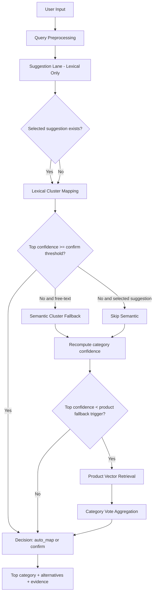
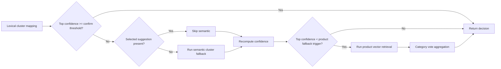

# Pepagora Search Functionality Approach (Stakeholder Submission)

Version date: 2026-04-09

## 1. Executive Summary

This document explains the implemented search and category-mapping approach for Post Buy Request.

The design is intentionally:

- Lexical-first for speed, stability, and explainability.
- Reliability-aware to handle sparse and ambiguous keyword clusters.
- Fallback-enabled (semantic cluster and product vote) only when confidence is weak.
- Audit-friendly, with explicit confidence, decision, margin, lanes used, and evidence in API responses.

## 2. Business Objective and Scope

Primary objective:

- Convert user intent text (typed query or selected suggestion) into reliable category mapping.

Secondary objective:

- Provide high-quality autosuggestions with low noise and low latency.

Scope for this flow:

- Intent to category mapping.

Out of scope for this decision stage:

- Product ranking as the primary output.

## 3. Data Used to Establish Search

This section clearly states what data is used and how each dataset contributes to search.

### 3.1 Upstream Source Data (Ingestion Inputs)

The Elasticsearch indices are built from MongoDB collections:

| Source Collection | Role in System |
|---|---|
| `liveproducts_v1` | Product master data for product index |
| `keyword_cluster` | Intent keyword clusters for suggestion and mapping lanes |
| `categories` | Category label resolution during indexing |
| `subcategories` | Sub-category label resolution during indexing |
| `productcategories` | Product-category label resolution during indexing |

### 3.2 Runtime Search Indices and Key Fields

#### A. Keyword Cluster Index (`pepagora_keyword_cluster`)

Used for:

- Autosuggest candidate generation
- Intent-to-category evidence aggregation

Key fields consumed at runtime:

| Field | Type | Used In |
|---|---|---|
| `keyword_name` | text | Primary lexical anchor for suggest and mapping |
| `variant_terms` | text | Secondary lexical candidate pool |
| `long_tail_terms` | text | Conditional lexical enrichment (strictly guarded) |
| `head_terms` | keyword | Guarded lexical source (outlier protected) |
| `product_count` | integer | Support strength for reliability weighting |
| `category_count` | integer | Ambiguity penalty in reliability weighting |
| `product_category_ids` | keyword[] | Category vote targets |
| `keyword_vector_longtail` | dense_vector | Semantic fallback lane |

#### B. Product Index (`pepagora_products`)

Used for:

- Product-name fallback suggestions
- Last-stage category vote fallback
- Category metadata hydration for response cards

Key fields consumed at runtime:

| Field | Type | Used In |
|---|---|---|
| `productName` | text | Product fallback suggestion source |
| `product_vector_main` | dense_vector | Product semantic retrieval for vote fallback |
| `product_vector_short` | dense_vector | Secondary semantic signal for vote fallback and rerank boost |
| `productCategory_id` | keyword | Vote bucket key for fallback |
| `category_name` | keyword | Breadcrumb rendering |
| `subCategory_name` | keyword | Breadcrumb rendering |
| `productCategory_name` | keyword | Breadcrumb rendering |

### 3.3 Data Quality Observations Used in Design

From indexed data profiling:

- Product index is high completeness and reliable for fallback voting.
- Keyword clusters are often sparse (`product_count` low in many docs).
- Many clusters are ambiguous (`category_count` > 1).
- Rare `head_terms` outliers are very large and can damage suggestion quality if not capped.

Design impact:

- Support smoothing and ambiguity penalty are mandatory.
- Head-term usage is guarded and capped.

### 3.4 Current Indexed Data Profile (Design Baseline)

The following profile numbers were used to define safeguards and thresholds:

| Metric | Value |
|---|---|
| Product index documents | `100,000` |
| Keyword cluster index documents | `511,124` |
| Product category-field completeness (sample) | `~99.3%` |
| Keyword clusters with `product_count <= 1` (sample) | `~54.3%` |
| Clusters with `category_count >= 3` (sample) | `~23.4%` |
| Head-term outlier docs (`head_terms > 1,000`) | `268` |
| Head-term outlier docs (`head_terms > 5,000`) | `22` |
| Head-term outlier docs (`head_terms > 10,000`) | `21` |

Why these metrics matter:

- High product completeness makes product-vote fallback dependable.
- Sparse cluster support requires support smoothing in reliability scoring.
- Category ambiguity requires explicit ambiguity penalties.
- Extreme head-term outliers justify strict term caps and guarded head-term use.

## 4. End-to-End Flow



## 5. Suggestion Lane (Lexical Fast Lane)

Endpoint:

- `GET /ui-api/suggestions`

### 5.1 Query Preprocessing

- Lowercase and token normalization.
- Remove connective noise words from significance logic.
- Build anchor token behavior for intent-preserving ranking.

### 5.2 Candidate Sources (Priority)

1. `keyword_name`
2. `variant_terms`
3. `long_tail_terms` (only with strong evidence)
4. `head_terms` (guarded mode only)
5. Product-name fallback from product index

### 5.3 Guardrails

- Skip `head_terms` when term-list size exceeds `HEAD_TERMS_HARD_CAP`.
- Truncate per document by configured limits:
  - `HEAD_TERMS_PER_DOC_LIMIT`
  - `VARIANT_TERMS_PER_DOC_LIMIT`
  - `LONG_TAIL_TERMS_PER_DOC_LIMIT`
- Remove low-signal noisy candidates.

### 5.4 Ranking Behavior

Ranking order is lexical stage-based and evidence-first:

- exact
- prefix
- ordered phrase
- ordered tokens
- weak contains
- fuzzy fallback

### 5.5 Exact Runtime Suggestion Pipeline (Implementation Detail)

Runtime function: `_fetch_keyword_suggestions(query, limit)`.

Execution sequence:

1. Build query context:
- `raw_tokens`
- `normalized_query`
- `intent_query`
- `phrase_candidates`
- `anchor_tokens`

2. Query keyword index (`pepagora_keyword_cluster`) with lexical `should` clauses over:
- `keyword_name`
- `variant_terms`
- `long_tail_terms`
- `head_terms`

3. Build candidate bucket using source priorities:
- `keyword_name`: priority `6`
- `variant_terms`: priority `5`
- `long_tail_terms`: priority `3`
- `head_terms`: priority `2`
- Product-name fallback (`pepagora_products.productName`): priority `1`

4. Apply guardrails per source:
- `variant_terms`: must pass strong evidence check.
- `long_tail_terms`: must pass strong evidence and stage must be `<= 4`.
- `head_terms`: only if doc head-term count `<= HEAD_TERMS_HARD_CAP`; each term must pass strong evidence and stage must be `<= 4`.

5. Deduplicate and rank with tie-break chain:
- stage quality
- token coverage
- first-token mismatch
- starts numeric
- first token position
- length delta
- source priority
- frequency
- score
- term length

6. Apply post-ranking denoise:
- suppress weak stage terms for multi-token queries when first token diverges.
- enforce prefix-order preference when query ends in connective noise token.
- optional anchor-token filter when enough high-signal suggestions remain.

7. Final selection:
- Prefer strong-stage items (stage `<= 4`) up to `limit`.
- Otherwise fill with best available ordered candidates.

### 5.6 Head-Term Handling (Plan vs Runtime)

Head terms are included by design, but only in guarded mode.

Head-term controls in runtime:

- Query-time contribution has lower weight than `keyword_name` and `variant_terms`.
- Per-document hard cap: skip all head terms if list size exceeds `HEAD_TERMS_HARD_CAP`.
- Per-document truncation: use only first `HEAD_TERMS_PER_DOC_LIMIT` unique head terms.
- Evidence gate: candidate must align strongly with current intent.
- Stage gate: candidate must stay in strong lexical stages (`<= 4`).

This preserves useful recall from head terms while preventing noisy takeover.

### 5.7 Incomplete-Term Suppression (Observed Production Case)

Observed issue:

- Suggestions such as `color t` or `stain g` appeared.

Root cause:

- These values existed in upstream indexed `head_terms`.
- Suggestion flow previously allowed truncated one-letter tail tokens to survive.

Implemented fix:

- Suggestion candidate is rejected when the last raw token is a single alphabetic character.

Effect:

- Incomplete terms are suppressed.
- Valid full terms such as `color t-shirts` remain eligible.

## 6. Mapping Lane (Category Intent)

Endpoints:

- `GET /ui-api/hierarchy`
- `GET /ui-api/map-category`

### 6.1 Notation

For cluster hit `i`:

- `p_i`: product support (`product_count`)
- `a_i`: ambiguity (`category_count`)
- `s_i`: normalized search score
- `m_i`: lexical match signal
- `w_lane`: lane weight (`1.0` lexical, semantic weight for semantic lane)

### 6.2 Reliability Factor

Reliability per cluster hit:

$$
R_i = \operatorname{clamp}\left(
\frac{\log(1+p_i)}{\log(1+P95)} \cdot \frac{1}{1+\beta(a_i-1)},
0.02,
1.25
\right)
$$

Where:

- `P95 = KEYWORD_P95_PRODUCT_COUNT`
- `beta = RELIABILITY_BETA`

Interpretation:

- Higher support increases trust.
- Higher ambiguity decreases trust.

### 6.3 Match Signal

`m_i` is derived from lexical quality over keyword_name, variants, long-tail, and (guarded) head terms, using:

- stage quality
- token overlap
- phrase bonus
- prefix bonus

with clamping to `[0, 1]`.

### 6.4 Document Vote Formula

Normalized search score:

$$
s_i = \frac{h_i}{\max_j(h_j)}
$$

Document vote:

$$
v_i = w_{lane} \cdot \left(0.55\,s_i + 0.45\,m_i\right) \cdot R_i
$$

If one cluster maps to multiple categories, vote is split equally across those categories.

### 6.5 Category Confidence

For category `k`:

$$
\mathrm{raw}_k = \sum_{i \in k} v_i
$$

$$
\mathrm{confidence}_k = \frac{\mathrm{raw}_k}{\sum_t \mathrm{raw}_t}
$$

Margin used for decisioning:

$$
\mathrm{margin} = \mathrm{confidence}_{top1} - \mathrm{confidence}_{top2}
$$

## 7. Thresholds and Decision Policy

Current runtime defaults:

| Parameter | Default |
|---|---|
| `AUTO_MAP_CONFIDENCE` | `0.72` |
| `AUTO_MAP_MARGIN` | `0.14` |
| `CONFIRM_MAP_CONFIDENCE` | `0.52` |
| `PRODUCT_FALLBACK_TRIGGER` | `0.42` |
| `SEMANTIC_CLUSTER_WEIGHT` | `0.62` |
| `PRODUCT_VOTE_WEIGHT` | `0.55` |
| `PRODUCT_MAIN_VOTE_SHARE` | `0.75` |
| `PRODUCT_SHORT_VOTE_SHARE` | `0.25` |
| `SHORT_VECTOR_RERANK_BOOST` | `0.18` |
| `KEYWORD_P95_PRODUCT_COUNT` | `17` |
| `RELIABILITY_BETA` | `0.35` |
| `KEYWORD_SUGGEST_DOCS` | `96` |
| `PHRASE_CANDIDATE_LIMIT` | `8` |

Decision rules:

| Decision | Rule |
|---|---|
| `auto_map` | `top_conf >= AUTO_MAP_CONFIDENCE` and `margin >= AUTO_MAP_MARGIN` |
| `confirm` | `top_conf >= CONFIRM_MAP_CONFIDENCE` and auto-map rule not met |
| `options` | otherwise show top alternatives |
| `no_match` | no usable evidence |

## 8. Fallback Control Flow



Important safety behavior:

- Semantic cluster lane is not always on; it is conditional.
- Product fallback maps by aggregated category votes, not by a single nearest product.

### 8.1 Product Main vs Product Short Order

The product-vector order is deterministic.

#### A. Mapping flow (`/ui-api/hierarchy`, `/ui-api/map-category`)

Product vectors are only used after lexical and optional semantic-cluster lanes fail to reach required confidence:

1. Run lexical cluster mapping.
2. If confidence is weak and input is free-text, run semantic cluster fallback.
3. If confidence is still below `PRODUCT_FALLBACK_TRIGGER`, start product-vector fallback.
4. Fetch kNN from `product_vector_main`.
5. Fetch kNN from `product_vector_short`.
6. Merge both into category votes using configured shares:
  - `PRODUCT_MAIN_VOTE_SHARE`
  - `PRODUCT_SHORT_VOTE_SHARE`
7. If both are present, both contribute by normalized shares.
8. If only one lane has hits, that lane contributes 100% of the product fallback vote.

This means `product_vector_short` is not an earlier lane; it is used inside the final product-vote fallback stage.

### 8.2 Free-Text vs Selected-Suggestion Mapping Behavior

Mapping lane behavior differs by user input mode:

1. Selected suggestion mode (`selected` provided):
- Semantic cluster fallback is skipped.
- Decision is made from lexical lane plus product-vote fallback (only if needed).

2. Free-text mode (`selected` not provided):
- Semantic cluster fallback may run when lexical confidence is below `CONFIRM_MAP_CONFIDENCE`.
- Product-vote fallback may run if confidence remains below `PRODUCT_FALLBACK_TRIGGER`.

This distinction is intentional: selected suggestions are treated as stronger lexical intent anchors.

#### B. Search flow (`/search`)

For `semantic` and `hybrid` modes:

1. Primary retrieval uses `product_vector_main` as the main kNN field.
2. `product_vector_short` is then used as a rerank/boost overlay on returned hits.
3. Final score is base ES score plus short-vector boost component.

So, in search mode, main is primary retrieval and short is secondary rerank.

## 9. API Outputs and Explainability

### 9.1 Suggestions API

- `GET /ui-api/suggestions?q=...&limit=...`
- Returns suggestions, count, ranking order, and latency.

### 9.2 Hierarchy Mapping API

- `GET /ui-api/hierarchy?keyword=...&max_cards=...`
- Returns decision, confidence, margin, lanes used, cards, and matched-doc count.

### 9.3 Intent Mapping API

- `GET /ui-api/map-category?q=...&selected=...&max_cards=...`
- Returns:
  - decision (`auto_map`, `confirm`, `options`, `no_match`)
  - confidence and margin
  - top category and alternatives
  - semantic/product fallback usage indicators
  - active thresholds

Evidence fields returned to support auditability:

- `ranking_basis`
- `sample_keywords`
- `sample_products`
- `avg_product_support`
- `avg_category_ambiguity`
- `lanes_used`

### 9.4 UI Rendering Contract for Mapping Cards

UI behavior is now confidence-aware and non-congested.

1. Selected suggestion:
- Request mapping with `selected=<keyword>`.
- Show only top-1 mapped category card.

2. Free text:
- Request up to 3 cards.
- Render dynamically:
  - show 1 when only top candidate is strong.
  - show 2 when top-2 are both relevant and close.
  - show 3 only when third candidate is also sufficiently relevant.

3. Diagnostics:
- Default card view is compact.
- Detailed evidence is available in collapsible diagnostics.

4. Display-level confidence formatting:
- Confidence values are normalized to percentage for readability.

## 10. Why This Approach Fits Current Data

1. Sparse support is handled through logarithmic support smoothing.
2. Ambiguous clusters are penalized before voting impact increases.
3. Head-term outliers are hard-capped and truncated.
4. Semantic lane is controlled and used only when lexical confidence is weak.
5. Product lane is a final fallback with vote aggregation, reducing one-hit errors.

## 11. Governance and Tuning

Primary tuning knobs:

- Suggestion quality:
  - `HEAD_TERMS_HARD_CAP`
  - `HEAD_TERMS_PER_DOC_LIMIT`
  - `VARIANT_TERMS_PER_DOC_LIMIT`
  - `LONG_TAIL_TERMS_PER_DOC_LIMIT`
- Reliability and confidence:
  - `KEYWORD_P95_PRODUCT_COUNT`
  - `RELIABILITY_BETA`
  - `AUTO_MAP_CONFIDENCE`
  - `AUTO_MAP_MARGIN`
  - `CONFIRM_MAP_CONFIDENCE`
  - `PRODUCT_FALLBACK_TRIGGER`
- Fallback influence:
  - `SEMANTIC_CLUSTER_WEIGHT`
  - `PRODUCT_VOTE_WEIGHT`

Recommended rollout KPIs:

- Suggestion selection rate
- Auto-map rate
- Confirm-required rate
- Top-1 acceptance rate
- Top-3 success rate
- P50/P95 latency by endpoint
- Semantic fallback activation rate
- Product fallback activation rate

### 11.1 Threshold Tuning Playbook (Required Before Final Lock)

Tuning should follow a fixed order to avoid coupled regressions.

Recommended sequence:

1. Freeze suggestion quality controls first:
- `HEAD_TERMS_HARD_CAP`
- `HEAD_TERMS_PER_DOC_LIMIT`
- `VARIANT_TERMS_PER_DOC_LIMIT`
- `LONG_TAIL_TERMS_PER_DOC_LIMIT`

2. Tune decision thresholds second:
- `AUTO_MAP_CONFIDENCE`
- `AUTO_MAP_MARGIN`
- `CONFIRM_MAP_CONFIDENCE`
- `PRODUCT_FALLBACK_TRIGGER`

3. Tune lane influence third:
- `SEMANTIC_CLUSTER_WEIGHT`
- `PRODUCT_VOTE_WEIGHT`
- `PRODUCT_MAIN_VOTE_SHARE`
- `PRODUCT_SHORT_VOTE_SHARE`

4. Validate each tuning pass against:
- selected-suggestion scenarios
- ambiguous free-text scenarios
- low-support sparse-cluster scenarios

5. Accept a new threshold set only if all pass criteria improve or remain stable:
- lower wrong auto-map rate
- stable or improved top-1/top-3 acceptance
- no significant latency regression (P95)

## 12. Validation Checklist (No-Gap Verification)

Before release, confirm all checks below are true.

Suggestion lane:

- `head_terms` are included only with guards.
- truncated one-letter tails are suppressed.
- stage/frequency/source-priority ordering behaves deterministically.

Mapping lane:

- lexical lane always runs first.
- semantic lane runs only for weak free-text lexical confidence.
- product-vote lane runs only below `PRODUCT_FALLBACK_TRIGGER`.
- category cards include explainability fields.

Vector behavior:

- `product_vector_main` is primary retrieval in semantic/hybrid search.
- `product_vector_short` is rerank boost in search.
- product-vote fallback merges main and short by configured shares.

UI behavior:

- selected suggestion shows top-1 card.
- free text shows dynamic top-1/top-2/top-3 based on relevance.
- diagnostics are collapsible, not always expanded.

## 13. Conclusion

The implemented search design is data-grounded, reliable under sparse and ambiguous cluster behavior, and submission-ready for stakeholders.

It provides:

- Clear architecture and flow control
- Formal, well-defined scoring equations
- Explicit thresholds and decisions
- Strong explainability and operational tuning controls
- Verified safeguards for noisy/incomplete suggestion terms
- Deterministic vector-lane order for both mapping and search

## 14. API Request and Response Examples

This section provides practical examples for QA, product, and stakeholder walkthroughs.

### 14.1 Suggestions API

Request:

```http
GET /ui-api/suggestions?q=color&limit=12
```

Expected response shape:

```json
{
  "query": "color",
  "suggestions": [
    "color pigments",
    "color powders",
    "color solutions",
    "color dye"
  ],
  "ranking_order": [
    "exact",
    "prefix",
    "ordered_phrase",
    "ordered_tokens",
    "weak_contains",
    "fuzzy_fallback"
  ],
  "count": 12,
  "latency_ms": 34.7
}
```

Validation notes:

- Incomplete tails such as `color t` or `stain g` should not appear.
- Head-term derived suggestions can appear only when guardrails are satisfied.

### 14.2 Mapping API (Free-Text)

Request:

```http
GET /ui-api/map-category?q=color sorter&max_cards=3
```

Expected response shape:

```json
{
  "query": "color sorter",
  "selected": null,
  "normalized_query": "color sorter",
  "decision": "options",
  "confidence": 0.41,
  "margin": 0.08,
  "needs_confirmation": false,
  "auto_mapped": false,
  "intent_query": "color sorter",
  "phrase_candidates": ["color sorter"],
  "top_category": {
    "product_category_id": "68a6...",
    "breadcrumb": "Food & Agriculture >> Processing Machinery >> Color Sorting",
    "confidence": 0.41
  },
  "cards": [
    {
      "product_category_id": "68a6...",
      "breadcrumb": "Food & Agriculture >> Processing Machinery >> Color Sorting",
      "count": 42,
      "correlation_pct": 41.0,
      "avg_token_coverage": 0.79,
      "ranking_basis": {
        "lexical_cluster_hits": 20,
        "semantic_cluster_hits": 14,
        "product_vote_hits": 8,
        "exact_hits": 20,
        "prefix_hits": 0,
        "token_and_hits": 0,
        "semantic_hits": 14
      },
      "sample_keywords": ["color sorter", "grain color sorter"],
      "sample_products": ["Automatic Grain Color Sorting Machine"],
      "confidence": 0.41,
      "avg_product_support": 5.2,
      "avg_category_ambiguity": 1.8,
      "reason": "support=5.20, ambiguity=1.80, lexical_hits=20, semantic_hits=14, product_votes=8"
    }
  ],
  "matched_clusters": 34,
  "product_vote_hits": 8,
  "lanes_used": ["lexical", "semantic", "product_vote"],
  "semantic_used": true,
  "product_fallback_used": true,
  "thresholds": {
    "auto_map": 0.72,
    "auto_map_margin": 0.14,
    "confirm": 0.52,
    "product_fallback": 0.42
  },
  "latency_ms": 186.3
}
```

Validation notes:

- Free-text can activate lexical, semantic, and product-vote lanes.
- UI should render 1/2/3 cards dynamically based on relevance, not always 3.

### 14.3 Mapping API (Selected Suggestion)

Request:

```http
GET /ui-api/map-category?q=color sorter&selected=color sorter&max_cards=1
```

Expected response behavior:

- Semantic fallback is skipped.
- `lanes_used` typically includes lexical and optional product_vote.
- UI should show only Top 1 mapped category card.

Expected response shape:

```json
{
  "query": "color sorter",
  "selected": "color sorter",
  "decision": "confirm",
  "lanes_used": ["lexical"],
  "semantic_used": false,
  "product_fallback_used": false,
  "cards": [
    {
      "breadcrumb": "Food & Agriculture >> Processing Machinery >> Color Sorting",
      "confidence": 0.67
    }
  ]
}
```

### 14.4 Search API (Hybrid Mode)

Request:

```http
GET /search?q=ss%20wire&page=1&mode=hybrid
```

Expected response shape:

```json
{
  "query": "ss wire",
  "total": 81,
  "page": 1,
  "page_size": 20,
  "pages": 5,
  "hits": [
    {
      "id": "abc123",
      "productName": "Industrial Stainless Steel SS Wire",
      "productDescription": "...",
      "category_name": "Industrial Supplies",
      "subCategory_name": "Wire",
      "productCategory_name": "Stainless Steel Wire",
      "score": 17.4331,
      "score_raw": 17.1904,
      "short_vector_boost": 1.3481,
      "confidence": 100.0
    }
  ],
  "facets": {
    "category": [
      {"name": "Industrial Supplies", "count": 51}
    ],
    "sub_category": [],
    "prod_category": []
  },
  "latency_ms": 492.1,
  "suggestion": null,
  "synonym_expanded": null,
  "search_mode": "hybrid",
  "semantic_short_used": true,
  "suppliers": []
}
```

Validation notes:

- `product_vector_main` is the primary kNN retrieval lane.
- `product_vector_short` contributes as rerank/boost in semantic or hybrid modes.

### 14.5 Quick QA Matrix

Use this matrix for rapid acceptance checks:

| Scenario | Expected decision | Expected lanes | UI cards |
|---|---|---|---|
| Clear selected suggestion | `auto_map` or `confirm` | lexical (+ optional product_vote) | 1 |
| Ambiguous free-text | `options` | lexical -> semantic -> optional product_vote | 2 or 3 if relevant |
| Weak sparse query | `options` or `no_match` | lexical -> semantic -> product_vote | 1 to 3 depending on relevance |
| Misspelled keyword | suggestions recover intent | lexical suggest lane | suggestion list only |

---

Document owner: Search Engineering

Implementation source: src/main.py

### Operational Commands (PowerShell)

```powershell
# Start API
./scripts/run_api.ps1

# Product indexing
./scripts/run_product_pipeline.ps1 create-index --recreate
./scripts/run_product_pipeline.ps1 backfill --batch-size 192 --published-only

# Keyword indexing
./scripts/run_keyword_pipeline.ps1 create-index --recreate
./scripts/run_keyword_pipeline.ps1 backfill --batch-size 400

# Benchmark
./scripts/run_benchmark.ps1 -QuerySet compact -Modes "keyword,semantic,hybrid"
```
